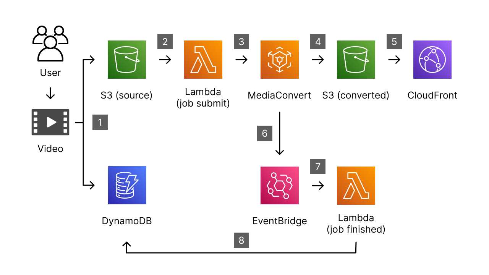

# AWS VOD Streaming

Build a video-on-demand (VOD) streaming service with multiple AWS services including:

- S3
- DynamoDB
- Lambda
- MediaConvert
- EventBridge
- CloudFront

## Overview



## Tutorial

You can see a full tutorial of this project in my blog.

- [Overview](https://blog.junkukim.com/posts/aws-vod-streaming-overview)
- [Upload video to AWS S3](https://blog.junkukim.com/posts/aws-vod-streaming-upload)
- [Convert video with AWS Lambda & MediaConvert](https://blog.junkukim.com/posts/aws-vod-streaming-convert)
- [Deliver converted video with CloudFront](https://blog.junkukim.com/posts/aws-vod-streaming-deliver)


## Getting Started

This repository contains React frontend, NodeJS backend app, and Lambda function codes. After cloning the repository, run following commands to start both frontend and backend.

```bash
npm install

cd frontend
npm install 

cd ../
npm run dev 
```
